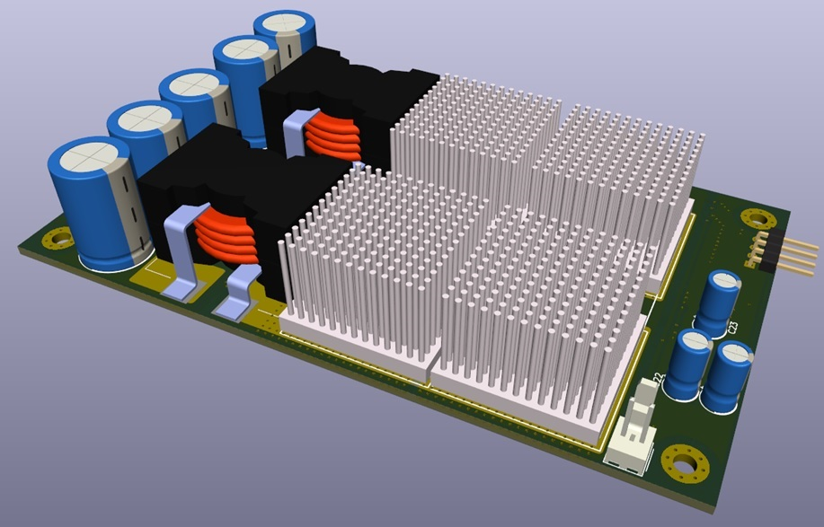
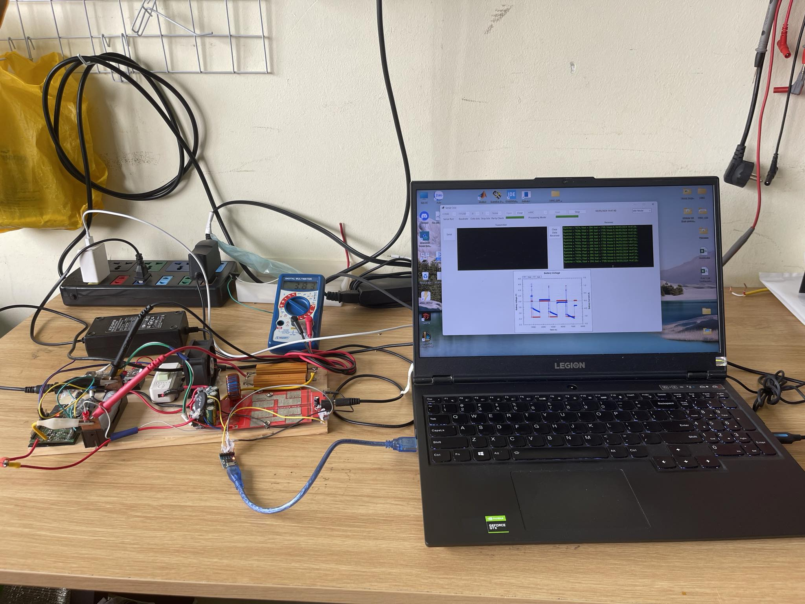

# BBBidir
EVSELab - HUST

Le Minh Quan & Dao Ngoc Tuan

**BBBidir** is an abbreviation for **Buck-Boost Bidirectional Charging/Discharging Converter**.

## Overview

BBBidir is a project focused on the development and implementation of a buck-boost bidirectional converter. This converter is capable of both charging and discharging operations, making it suitable for various energy storage applications, specifically designed for testing Lithium-ion and Lead-acid batteries.

This project is built upon the **300W Power Supply for Portable Fridge from [EVSELab](https://evselab.com/)**, incorporating several hardware and firmware hacking and modifications to suit specific needs. 

**These modifications have been legally permitted!!!**

## Features

- **Bidirectional Operation**: Supports both charging and discharging modes.
- **Buck-Boost Functionality**: Can step up (boost) or step down (buck) voltage as needed.
- **High Efficiency**: Achieves up to 95% efficiency using a synchronous half-bridge topology.
- **Battery Compatibility**: Suitable for Lithium-ion and Lead-acid batteries.
- **Voltage Range**: Can handle up to 60V.
- **Current Capacity**: Supports up to 5A.
- **Automated Control Integration**: Modified to interface with [BATLab](https://github.com/renivimere/BATLab) software for automating experimental procedures, saving time and labor.
- **Optimized Firmware**: Utilizes the [ARM Cortex-M0 XMC1301](https://www.infineon.com/cms/en/product/microcontroller/32-bit-industrial-microcontroller-based-on-arm-cortex-m/32-bit-xmc1000-industrial-microcontroller-arm-cortex-m0/xmc1301-t016f0032-ab/). The firmware has been optimized for this simple, cost-effective microcontroller to perform complex control calculations.
- **Communication with BMS 1.0**: Firmware is tailored to communicate with [BMS 1.0](https://github.com/renivimere/BMS_1.0), compensating for the converter not being located near the battery pack.
- **Versatile Applications**: Ideal for use in energy storage systems, renewable energy systems, and electric vehicles.
- **Enhanced with Modifications**: Includes custom hardware and firmware modifications for improved performance and functionality.

## Note

Due to technology security concerns, the original firmware and schematic will not be disclosed. Apologies for any inconvenience caused.
